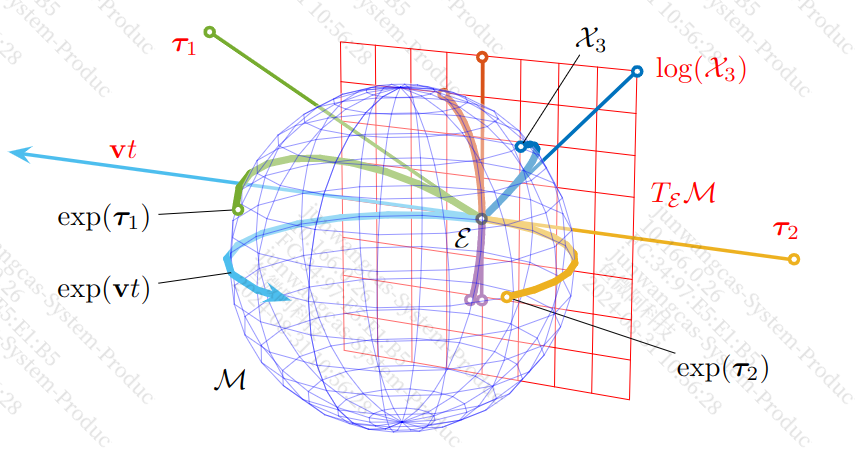
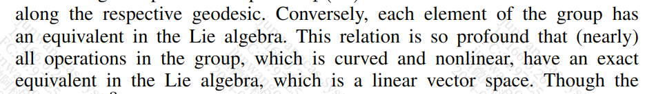

《A micro Lie theory for state estimation in robotics》阅读笔记一

这篇文章是目前看到最好的讲解机器人中使用Liegroup的文章

##### I Introduction

和以前接触过的一些数学概念相比，Liegroup是很抽象的，难以理解并熟练应用。如果能充分理解这篇文章的话，足以在工作中熟练使用Liegroup了

从几何的角度理解Liegroup是非常必要的

这张图在17年一次会议b同学展示过，其代表的意义如下

1. $M$ : Lie group's manifold (蓝色球形)
2. $T_\varepsilon M$ : Lie algebra （红色切平面）
3. $\varepsilon$  : identity (类似坐标原点)
4. $vt$ : 经过原点的直线路径
5. $exp(vt)$ : 上面vt对应的manifold上面的点

这一点非常重要，Lie group是非线性的，Lie algebra是线性的，有了这层关系，那我们岂不是将复杂问题线性化。从功效上来说，有点类似泰勒展开了。

